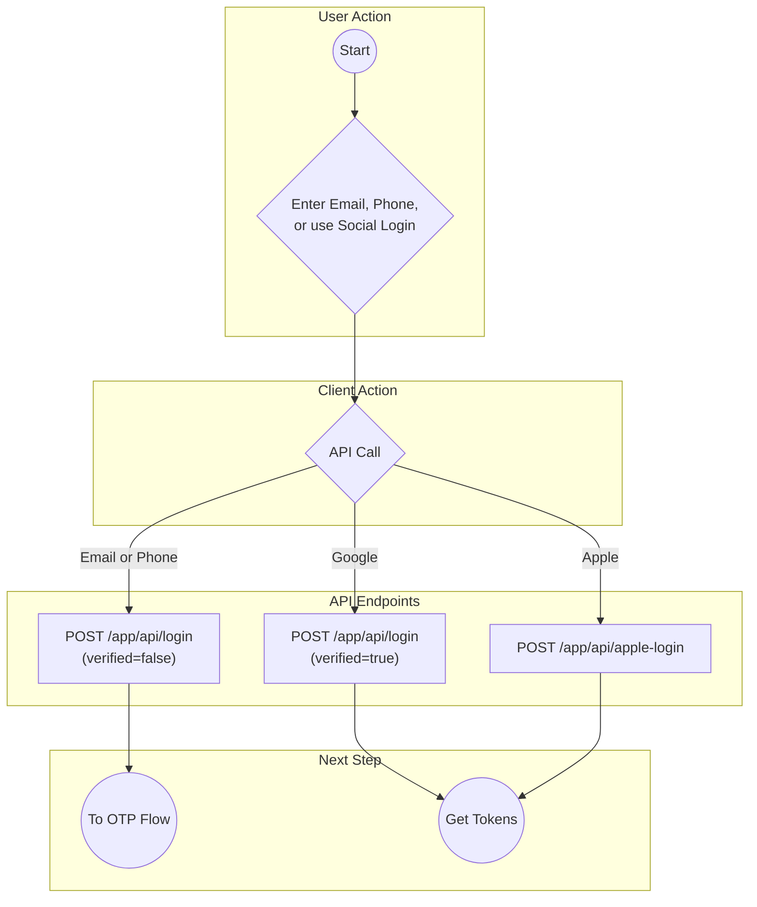
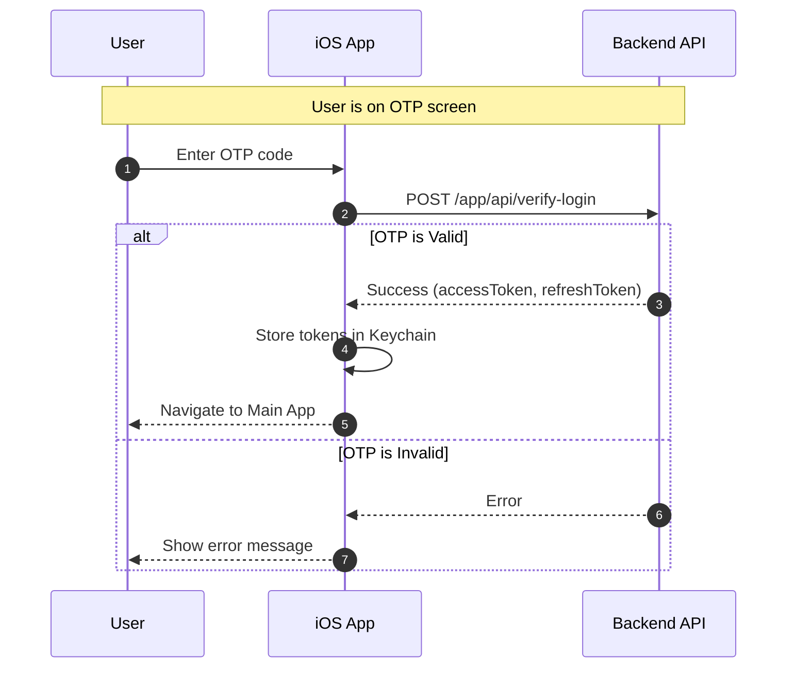

# Diagram: Authentication Flow

> Canonical doc: `../overview.md`

This document contains simplified diagrams for the main authentication flows.

---

## 1. Unified "Continue" Flow (Sign-in / Sign-up)

This diagram shows the initial step where the user provides an identifier. The backend determines if it's a new registration or an existing user login.

---

## 2. OTP Verification Flow

This flow is triggered after the user submits their email or phone number.

