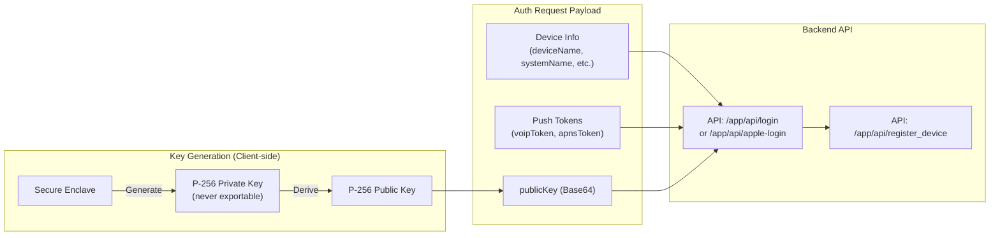

# Diagram: Device Registration & Key Upload

> Canonical doc: `../overview.md`

## Flow

This flow happens during the first successful login on a new device.

## Security Notes

- The client decides which key type to generate (P-256 is preferred).
- The private key never leaves the device's Secure Enclave.
- The backend stores the public key provided by the client for use in E2EE calls.
- The API endpoint for registering the device is `/app/api/register_device`.
