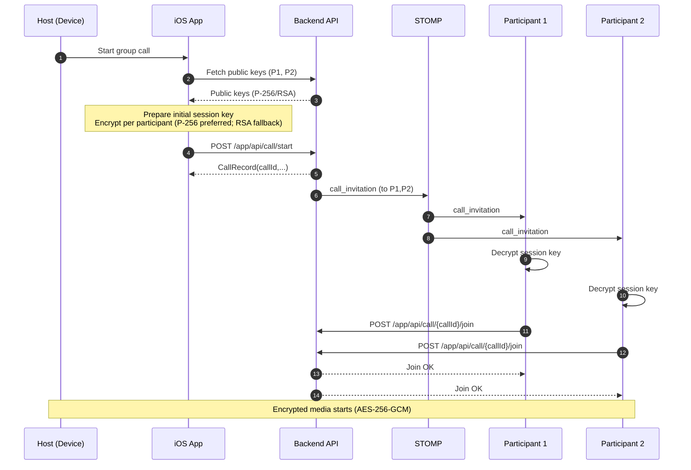

# Diagram: Group Call Flow (Audio/Video)

> Canonical doc: `../group-call.md`

```mermaid
sequenceDiagram
    autonumber
    participant Host as Host (Device)
    participant App as iOS App
    participant API as Backend API
    participant STOMP as STOMP
    participant P1 as Participant 1
    participant P2 as Participant 2

    Host->>App: Start group call
    App->>API: Fetch public keys (P1, P2)
    API-->>App: Public keys (P-256/RSA)

    Note over App: Prepare initial session key<br/>Encrypt per participant (P-256 preferred#59; RSA fallback)

    App->>API: POST /app/api/call/start
    API-->>App: CallRecord(callId,...)

    API->>STOMP: call_invitation (to P1,P2)
    STOMP->>P1: call_invitation
    STOMP->>P2: call_invitation

    P1->>P1: Decrypt session key
    P2->>P2: Decrypt session key

    P1->>API: POST /app/api/call/{callId}/join
    P2->>API: POST /app/api/call/{callId}/join
    API-->>P1: Join OK
    API-->>P2: Join OK

    Note over Host,P2: Encrypted media starts (AES-256-GCM)
```
