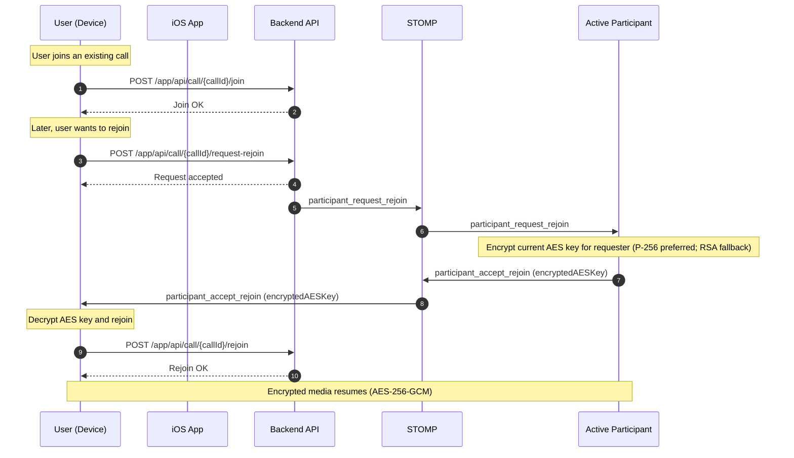

# Diagram: Join & Rejoin

> Canonical doc: `../join-rejoin.md`

```mermaid
sequenceDiagram
    autonumber
    participant U as User (Device)
    participant App as iOS App
    participant API as Backend API
    participant STOMP as STOMP
    participant P as Active Participant

    Note over U: User joins an existing call
    U->>API: POST /app/api/call/{callId}/join
    API-->>U: Join OK

    Note over U: Later, user wants to rejoin
    U->>API: POST /app/api/call/{callId}/request-rejoin
    API-->>U: Request accepted

    API->>STOMP: participant_request_rejoin
    STOMP->>P: participant_request_rejoin

    Note over P: Encrypt current AES key for requester (P-256 preferred#59; RSA fallback)
    P->>STOMP: participant_accept_rejoin (encryptedAESKey)
    STOMP->>U: participant_accept_rejoin (encryptedAESKey)

    Note over U: Decrypt AES key and rejoin
    U->>API: POST /app/api/call/{callId}/rejoin
    API-->>U: Rejoin OK

    Note over U,P: Encrypted media resumes (AES-256-GCM)
```
