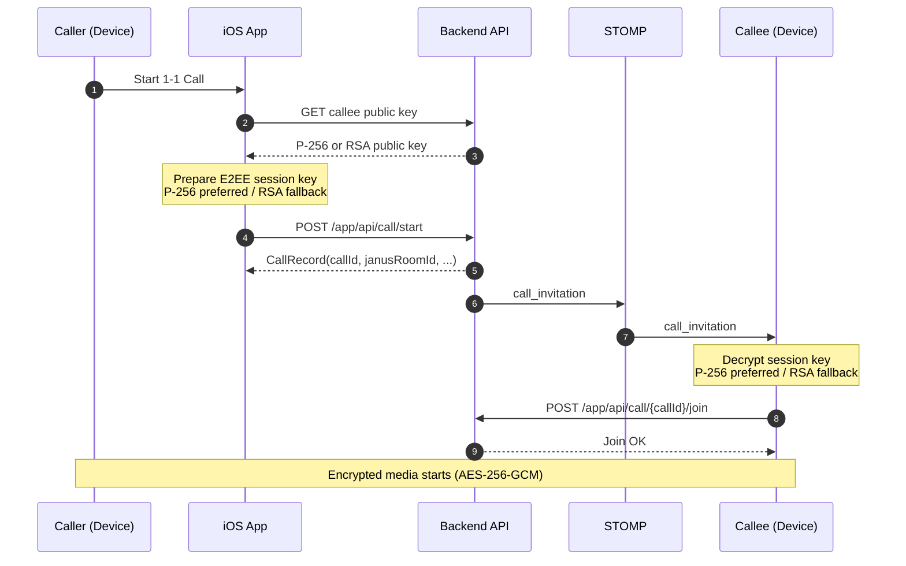

# Diagram: 1-1 Call Flow (Audio/Video)

> Canonical doc: `../one-to-one.md`

```mermaid
sequenceDiagram
    autonumber
    participant Caller as Caller (Device)
    participant App as iOS App
    participant API as Backend API
    participant STOMP as STOMP
    participant Callee as Callee (Device)

    Caller->>App: Start 1-1 Call
    App->>API: GET callee public key
    API-->>App: P-256 or RSA public key

    Note over App: Prepare E2EE session key<br/>P-256 preferred / RSA fallback

    App->>API: POST /app/api/call/start
    API-->>App: CallRecord(callId, janusRoomId, ...)

    API->>STOMP: call_invitation
    STOMP->>Callee: call_invitation

    Note over Callee: Decrypt session key<br/>P-256 preferred / RSA fallback

    Callee->>API: POST /app/api/call/{callId}/join
    API-->>Callee: Join OK

    Note over Caller,Callee: Encrypted media starts (AES-256-GCM)
```
