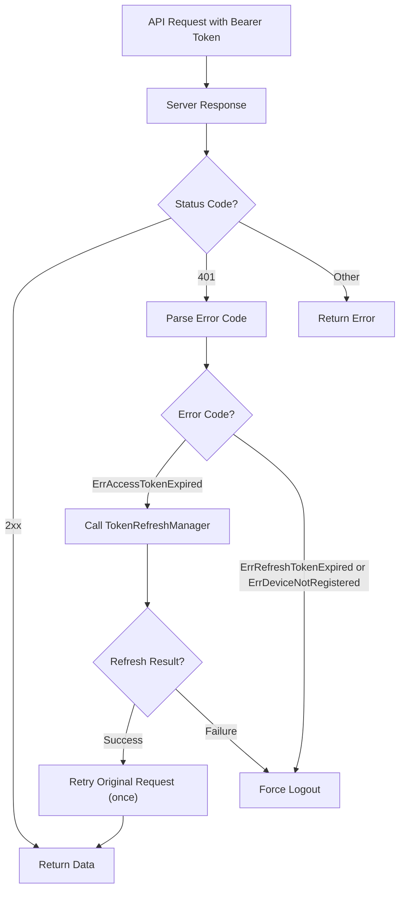
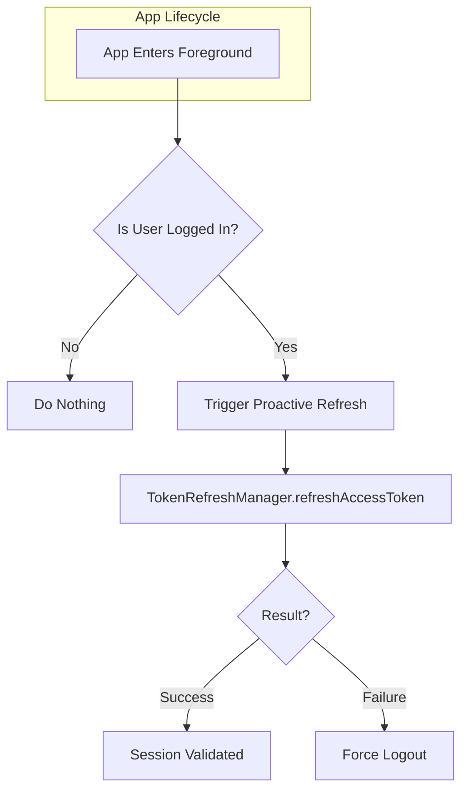
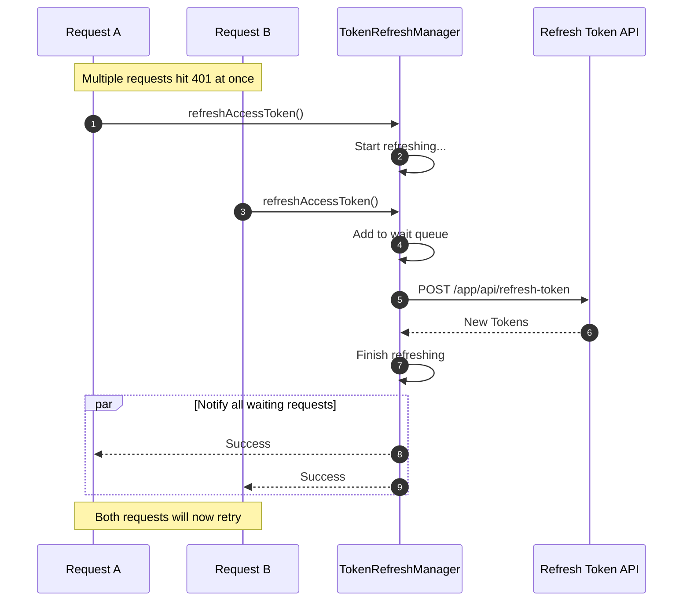

# Diagram: Token Refresh & Session Management

> Canonical doc: `../token-refresh.md`

This document contains simplified diagrams for the token refresh and session management flows.

---

## 1. Overview: Token Refresh Flow (on 401 Error)

This is the main flow, triggered when an API call returns a `401 Unauthorized` error because the access token has expired.

---

## 2. Proactive Refresh Flow (on App Foreground)

To improve user experience, the app automatically refreshes the token when it returns to the foreground.

---

## 3. Thread-Safe Refresh Queue

`TokenRefreshManager` ensures only one refresh request is active at a time, even if multiple API calls fail simultaneously.

