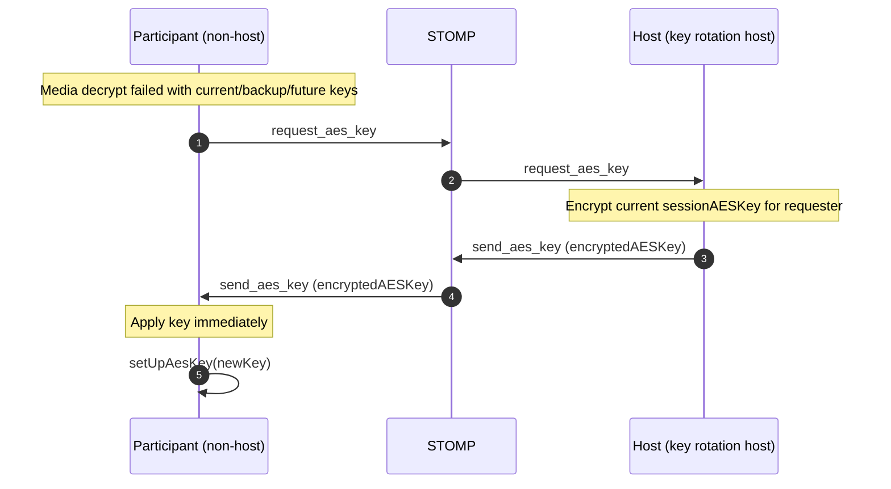

# Diagram: Emergency Key Redistribution (Decrypt Media Fail)

> Canonical doc: `../../security/key-rotation.md`

```mermaid
sequenceDiagram
    autonumber
    participant P as Participant (non-host)
    participant STOMP as STOMP
    participant H as Host (key rotation host)

    Note over P: Media decrypt failed with current/backup/future keys
    P->>STOMP: request_aes_key
    STOMP->>H: request_aes_key

    Note over H: Encrypt current sessionAESKey for requester
    H->>STOMP: send_aes_key (encryptedAESKey)
    STOMP->>P: send_aes_key (encryptedAESKey)

    Note over P: Apply key immediately
    P->>P: setUpAesKey(newKey)
```
