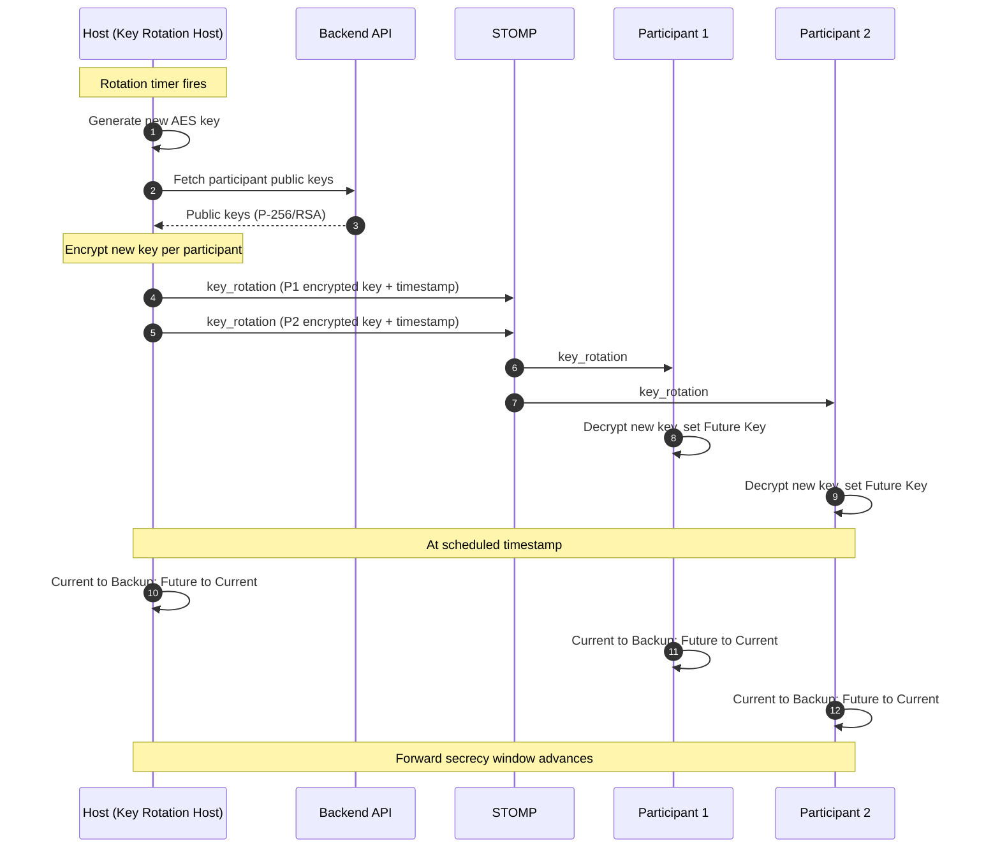

# Diagram: Key Rotation Overview (Group Calls)

> Canonical doc: `../../security/key-rotation.md`

```mermaid
sequenceDiagram
    autonumber
    participant Host as Host (Key Rotation Host)
    participant API as Backend API
    participant STOMP as STOMP
    participant P1 as Participant 1
    participant P2 as Participant 2

    Note over Host: Rotation timer fires
    Host->>Host: Generate new AES key
    Host->>API: Fetch participant public keys
    API-->>Host: Public keys (P-256/RSA)

    Note over Host: Encrypt new key per participant
    Host->>STOMP: key_rotation (P1 encrypted key + timestamp)
    Host->>STOMP: key_rotation (P2 encrypted key + timestamp)

    STOMP->>P1: key_rotation
    STOMP->>P2: key_rotation

    P1->>P1: Decrypt new key, set Future Key
    P2->>P2: Decrypt new key, set Future Key

    Note over Host,P2: At scheduled timestamp
    Host->>Host: Current to Backup#59; Future to Current
    P1->>P1: Current to Backup#59; Future to Current
    P2->>P2: Current to Backup#59; Future to Current

    Note over Host,P2: Forward secrecy window advances
```
